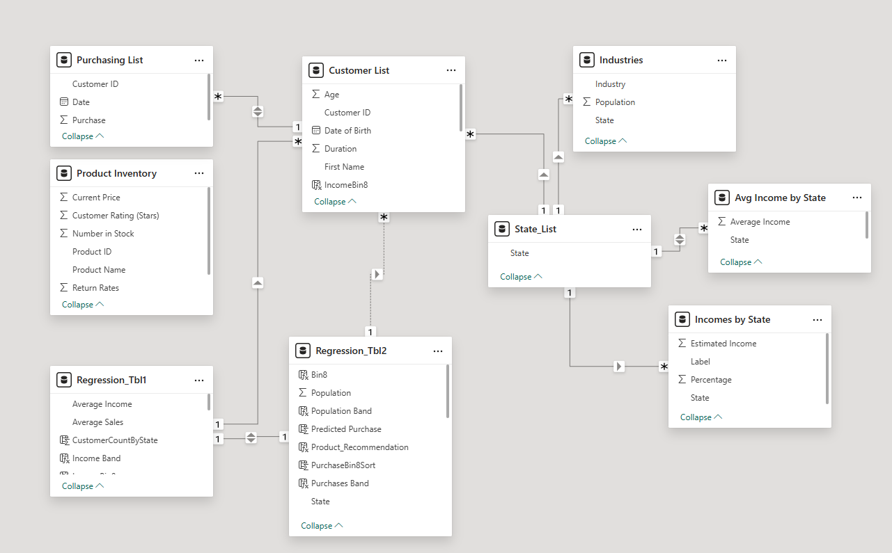
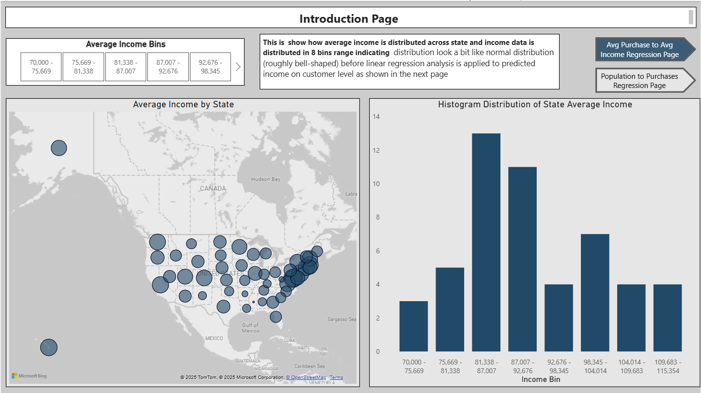
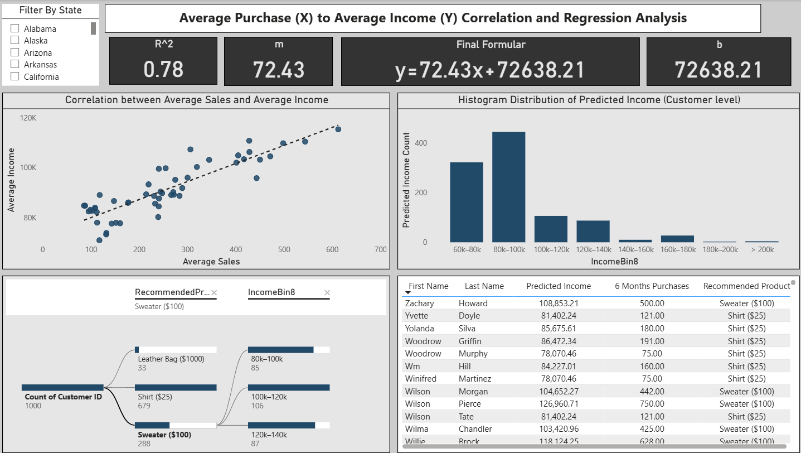
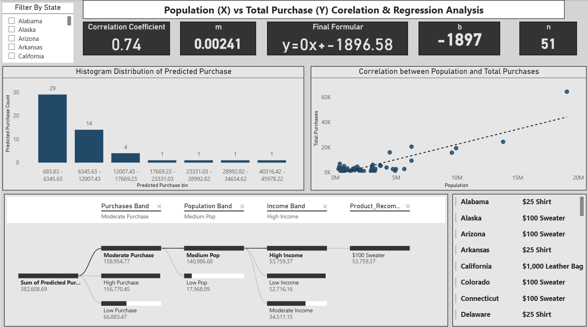

# Market Analysis Report for National Clothing Chain


# Table of Content
- [Project Title](#project_title)
- [My Role](#my_role)
- [Project Overview](#Project_Overview)
- [Problem Statement](#Problem_Statement)
- [Stakeholder Engagement](#Stakeholder_Engagement)
  - [Targetd Stakeholder](#Targeted_Stakeholder)
  - [Use Cases](#Uses_Cases)
  - [Stakeholder Stories](#Stakeholder_Stories)
  - [Acceptance Criteria](#Acceptance_Criteria)
  - [Success Criteria](#Success_Criteria)
- [Data Source](#Data_Source)
  - [Dataset](#Dataset)
  - [Data Model Structure](#Data_Model_Structure)
- [Methodology](#Methodology)
  - [Tools Used](#Tools_Used)
  - [Development](#Development)
    - [ETL Process](#ETL_Process)
    - [Project Planning & Requirement](#Project_Planning_&_Reqquirement)
    - [Data Exploration & Profiling](#Data_Exploration_&_Profiling)
    - [ETL with Power Query & Data Modelling](#ETL_with_Power_Query_&_Data_Modelling)
    - [Measures & Calculations](#Measures_&_Calculations)
    - [Dashboard Design & Visualisation (3 Dashboards)](#Dashboard_Design_&_Visualisation_(3_Dashboards))
    - [Polishing_&_Collaboration](#Polishing_&_Collaboration)
    - [Documentation & Version Control](#Documentation_&_Version_Comtrol)
    - [Review & Iteration](#Review_&_Iteration)
- [Detailed Insights & Recommendation](#Detailed_Insights_&_Recommendation)
  - [Dashboard 1 - Income Distribution& Geography](#Dashboard_1_-_Income_Distribution_&_Geography)
  - [Dashboard 2 - Avg_Purchase_to_Avg_Income_(Regression)](#Dashboard_2_-_Avg_Purchase_to_Avg_Income_(Regression))
  - [Dashboard 3 - Population to Total Purchases (Regression)](#Dashboard_3_-_Population_to_Total_Purchases_(Regression))
- [Stakeholder_Summary](#Stakeholder_Sumamery)
- [Data Governance, Assumption & Risks](#Data_Governanc,_Assumptions_&_Risk)

# Project Title
Market Analysis & Targeted Product Recommendations for a National Clothing Chain

# My Role
**Market & Business Intelligence Analyst (Marketing Analyst)**
- Led the end-to-end marketing analysis, regression modelling, and scenario forecasting.
- Built the Power Bi data model, DAX measures, decision rules, and executives dashboards
- Partnered with CRM for audience activation and with **Merchandising** for inventory alignment.

# Project Overview 
This project converts raw purchase and census data into an **actionable target map** We:
1. Model **Income to Purchasing** at state grain to produce a transparent linear model.
2. Predict **Customer-level** income using recent purchases, segment customers into **income bins**, and map bins to **recommended products**
3. Validate promotion risk using **Customer Rating to Return Rate** correlation.
4. Provide **scenario planning** (what-if targets, response, margin, return rates) for **forecasting revenue**, **ROI and profit**

# Problem Statement
Sales have stagnated and lapsed customers are difficult to re-engage without **precise targeting**. The business needs to know needs to know which product each customer is most likely to buy and where to focus media so that spend converts onto incremental profit.

# Stakeholder Engagement

## Targeted Stakeholder
Decision makers and operators who convert analytics into **campaigns**, **inventory plans**, and **budget allocations**.

- **CMO/VP Growth** - Owns budget & KPIs; approves targeting/cereatives.
- **Head of CRM & Lifecycle** - Activates segments in ESP & paid social.
- **Merchandising/Supply** - Aligns stocks/fulfilment with forecasted demand.
- **E-commerce PM** Onsites personalisation, landing pages.
- **Finance** Validates ROI assumptions, approves profit model.

## Use Cases
- **Targeting**: Export list of customers with **Predicted Incomes Bin** and **Recommended Product**.
- **Geo Prioritisation**: Rank **states/regions by income potential & purchase propensity.
- **Forecasting**: Use what-if control to plan **expected orders**, **revenue**, **returns**, and **profit**
- **Quality Gate**: Suppress products with high Return Rate given a rating threshold.

## Stakeholders Stories

- As a CMO, I need a defensible model linking purchasing to income so I can allocate budget with confidence.
- As a CRM Manager, I need a clean customer table with product recommendations and clear filters.
- As Merchandising, I need SKU‑level visibility of forecasted demand to adjust buys and avoid stockouts/overstock.

## Acceptance Criteria

- Power BI report includes: income map, income histogram, scatter with trendline and R² card, customer recommendation table, and a scenario/forecast block.
- DAX measures for slope (m), intercept (b), Pearson r, R², Predicted Income, Recommended Product, and Forecast KPIs (orders, revenue, returns, profit).
- PDF summary answers the five core questions and states the go‑to‑market plan.

## Success Criteria

- Evidence of positive, material correlation between income and purchases at state level.
- A ranked customer list with counts per product and clear geo lenses.
- A forecasting panel that shows ROI sensitivity to response rate and return rate.
- Stakeholders sign off target segments and budget split.

# Data Source

- **US Census Bureau**: Avg income, population, industries.
- **Business Data**: Product inventory, prices, Customer Rating, Return Rate.
- **Customer Data**: Customer list, purchase history.
- **Reference**: State list/regions.
- **Optional**: Weather, unemployment, competition density for further robustness.

## Dataset

Initially 4 dataset was provided by stakeholder for the completion of this project (or can be dowloaded in the provided GitHub repository). These four data are census data, customer list, purchase list and state list spreadsheets. Finally, after integrating the various spreadsheet into power BI, result into 7 tables listed below;

- **Avg Income by State**

| Column Name | Data type | Description |
| --- | ---| --- |
| State | Text | Name of State and Foreign Key |
| Average Income | Decimal Number | Average income across each state |

- **Customer List**

| Column Name | Data type | Description |
| --- | ---| --- |
| Customer ID  | Text | Foreign key |
| First Name | Text | customer first name |
| Last Name | Text | Customer Last Name |
| Date of Birth | Date | customers date of birth |
| State | Text | State which each customers comes from |
| Last 6 Months Purchase | Decimal Number | Total sum of purchases in the last 6months by each customers |
| Duration | Time | Duration in hours from the day each customer was born till date |
| Age | Whole Number | Age of customer |

- **Income by State**

| Column Name | Data type | Description |
| --- | ---| --- |
| State | Text | foriegn key |
| Label | Text | salary range in each Country |
| Percentage | Decimal Number | each salary range percentage breakdown to the overal percentage |
| Estimated Income | Whole Number | each state salary range estimation |

- **Industries**

| Column Name | Data type | Description |
| --- | ---| --- |
| Sate | Text | Primary Key linking to Fact table |
| Industry | Text | Various indudtries that existed in each state |
| Population | Whole Number | Total Population that existed by industry in each state |

- **Product Inventory**

| Column Name | Data type | Description |
| --- | ---| --- |
| Product ID | Text | Primary key linking fact and Dim together |
| Product Name | Text | Name of Product |
| Current Price | Whole Number | Price tag for each product |
| Number in stock | Whole Number | each product total stock available |
| Customer rating | Decimal Number | overall rating for each product |
| Return Rates | Decimal Number | rate at which each product are being returned |

- **Purchasing List Table**

| Column Name | Data type | Description |
| --- | ---| --- |
| Customer ID | Text |  |
| Date | Date | Date at which customers purchases |
| Purchase | Decimal Number | Purchases made by each customers |

- **State List**

| Column Name | Data type | Description |
| --- | ---| --- |
| State | Text | Primary Key |  


## Data Model Structure 
Star schema with conformed dimensions and supporting regression tables:  

- FactOurchases: CustomnerID, ProductID, Date, Quantity, Unit Price, Amount
- DimCustomer: CustomerID, Name, DOB, City, State, ZIP, Segment.
- DimProduct: ProductID, Name, Category, ListPrice, CustomerRating, ReturnRate.
- DimState: State, StateCode, Region.
- DimIncome: State, AvgIncome (joins via DimState).
- DimDate: Date, Year, Quarter, Month.
- Regression_Tbl (state grain): x_AvgIncome, y_AvgSales6M, helpers (x2, y2, xy).
- ProdCorr_Tbl (product grain): rating, returnRate for quality correlation.



# Methoodology
1. **Ingest & conform** data (typing, State codes, currency).
2. **Aggregate to state** to compute **AvgIncome** and Avg **6-month sales**.
3. Fit transparent **linear regression** using DAX aggregatres (m, b, r, R²).
4. **Predict income** at **customer level*8 from 6‑month purchases; bin incomes and map **product**.
5. Build **forecast layer** with what‑if parameters for coverage, response, margin, return rate, and media cost to project **orders, revenue, returns, profit**.
6. Validate ratings vs returns correlation to avoid promoting high‑return items.

## Tool Used 
- **Power BI Desktop** (Power Query, DAX, Mapping, Decomposition Tree, Bookmarks)
- **Microsoft Excel spreadsheet** for raw data review
- **Word Docs** for stakeholder summary

## Development 
- Iterative sprints: Data ➜ Model ➜ Measures ➜ Visuals v UAT ➜ Sign-off
- Consistent typography and monochrome palette with accent highlights.
- Bookmark navigation between **introduction, income ➜ Purchase**, and **Population ➜ Purchase** pages.

### ETL Process 
**Purchasing List (Power Query)**:
- **Upivot**: Converted wide date Columns to long format (attribute = DateText, value = Purchase). Initially removed duplivates, but this collapsed true multiple purchases.
- **Fix**: Reverted Remove Duplicate and intead filtered out null/0 rows created by the unpivot.
- Date parsing (text → date): Normalised ordinal suffixes then parsed to Date.
  - M pattern used:

```M.Language
// DateText is the text column after Unpivot
CleanDateText = Table.TransformColumns(PrevStep,
  {{"DateText", each Text.Replace(Text.Replace(Text.Replace(Text.Replace(_, "st", ""), "nd", ""), "th", ""), ",", ""), type text}}),
ParsedDate = Table.TransformColumns(CleanDateText, {{"DateText", each
Date.FromText(_), type date}})
```
(Original intent as written during build: 
```M.Language
Date.FromText(Text.Replace(Text.Replace(Text.Replace(Text.Replace([Date.Text], "st", " "), "nd", " "), "th", " "), ",", " "))))
```

**State List**: No formating required.  
**Product Inventory**:  No fromating required currently.  
**Customer List**: No formating at ingestion; **Last-6-Month Purchases** used later in analysis.  
**Industries**: No transformations.
**Average Income by State**: Clean with no blank/no formating needed.  

**First Modelling Challenge**
- **Issue**: State_list and Customer_list would not relate via state due to hidden whitespace
- **Fix**: Applied Text.Trim to Customer List State prior to relationship creation

### Project Planning & Requirement 
- **In‑scope**: three‑product recommendation, state‑grain regression, forecast what‑ifs, exportable customer list.
- **Out‑of‑scope**: full ML propensity pipeline, cross‑channel attribution, causal lift modelling (can be Phase 2).
- **Timeline**: 2–3 sprints (ETL+Model, Measures+Visuals, UAT+Docs).

### Data Explorationn & Profiling 
- **Purchasing List**: Detected an incorrect **1:1** with customer after an early Remove Duplicate. **Root cause**: Unpivot producec manay row with **null/0** purchases. **Resilution**: remove null/0 row instead of deduping; restored true cardinality.
- Verified ranges and distributions for **Income, Purchases, Rating, Return, Rate**.

### ETL with Power Query & Date Modeling

- Enforce one-directional filters from dimensions to fact; avoid many-to-many.
- Hide technical column; create calculation groups/measures folder for clarity.

#### Measures & Calculations
**Regression Table (state grain)**
- **Objective**: Predict **customer Income** using a transparent, state-level linear model.
- **Build**:
  1. Duplicate **Customer List** and **grouped** to **Average Sales by State** (6-month window
  2. **Merged** with **Avg Income by State** to create **Regression_Table** with:
  3. Added helper Columns: X^2 = X * X, Y^2 = Y * Y, XY = X * Y.
  4. Measures: Sumx, SumY, SumXY, SumX^2, SumY^2, n, m (slope), b(INTERCEPT), R, R^2.
 
#### Fitted values (state model)
- n = 51, 72.43, b = 72,638.21, **R^2 = 0.78** (positive, meaningful fit).
- **Model equation**: For x = 345 (state-avg sales), y = 72.43 * 345 + 72,638.21 = 97,627

#### Customer-level prediction strategies
- **Option A - State**: Assign each customer the state‑level predicted income (x = state avg purchases).
- **Option B – Customer actuals (chosen)**: Use **customer’s last‑6‑months purchases** as x in the **same state model**:  
Predicted Income ($) = m × CustomerSales_6M + b.

#### Binning & Recommendations
- Created **8 income bins** (~$20k width).
- Rule set (tunable): <$60k → Shirt ($25), $60–$120k → Sweater ($100), >$120k → Leather Bag ($1,000).


#### Quality correlation
- Product‑level table for Rating vs Return Rate to compute r and R² (used as a quality gate in targeting).

### Dashboard Design & Visualisation (3 Dashboards)
- **Dashboard 1**: Income distribution & geographic potential (overview, slicers, narrative card).
- **Dashboard 2**: Avg Purchase ↔ Avg Income with trendline, per‑customer predicted income histogram, product recommendation counts, and forecast block.
- **Dashboard 3**: Population ↔ Total Purchases with decomposition tree to explain contribution paths and to guide geo‑allocation.

### Polishing & Collaboration
- Clear, verb‑led titles (“Where income is highest”, “Income predicts purchasing”).
- Tooltips showing **AvgIncome, Avg 6M Sales, Customer Count**, and R**ecommended Product split**.
- Measure descriptions and calculation notes embedded for future maintainers.

### Documentation & Version Control
Repository structure:  
├─ /Makert_Analysi_Report/Asset  
├─ /Asset/Dataset_Folder/census-data.xlsx/customer-list.xlsx/purchase-list.xlsx/state-list.xlsx  
├─ /Asset/Doc_&_PDF/Market Analysis Report.docx/README.md  
├─ /Asset/Image_Folder/Data_model.png/shopping_mall.jpg/README.md  
├─ Asset/Pbix_Folder/Market Analysis Report 1.pbix  
└─ README.md (this file)  


# Detailed Insights and Recommendations

## DASHBOARD 1:  Introduction Page


**Overview**  
This dashboard visualizes how **average income is distributed across U.S. states**, grouped into **8 income bins** ranging from $70K to $115K. It provides an overview of the demographic foundation before applying regression analysis to understand **income–purchase relationships** in later dashboards.  

**Key Visuals**  
- **Map**: Map: Average Income by State
- **Histogram**: Distribution of State Average Income
- **Income Bin Filters**: $70K–$115K grouped in eight ranges

📌 **Insights**:  
- The histogram shows a roughly **bell-shaped distribution**, suggesting most states cluster between **$81K–$92K average income**, aligning with a **normal distribution pattern**.
- The map highlights income concentration along the **East Coast, West Coast, and parts of the South**, with high-income states like **California, New York, and Massachusetts** standing out.
- Lower-income states ($70K–$75K) are concentrated in the **Midwest and Southeast**, indicating potential price sensitivity and preference for **affordable apparel lines**.  


📊 **Interpretation**:  
- The income distribution sets a foundation for understanding **customer purchasing power segmentation**.
- States in the middle-income bins (around $81K–$92K) form the largest consumer cluster, ideal for mid-range fashion pricing strategies.

✅ **Conclusion**:  
This initial view establishes that state income levels vary predictably, providing a logical base for correlating income with spending patterns in later regression analyses.


## DASHBOARD 2: Average Purchase (X) to Average Income (Y) Correlation and Regression Analysis



**Overview**  
This dashboard analyzes the relationship between average customer purchases and average income, leveraging linear regression to predict income and recommend products aligned with affordability and spending power.

**Headline Metrics**  
| Metric | Value |
| --- | --- |
| R² (Correlation Strength) |	0.78 |
| Regression Formula |	y = 72.43x + 72,638.21 |
| Slope (m) | 72.43 |
| Intercept (b) |	72,638.21 |  

📈 **Insights**:  
1. A strong positive correlation (R² = 0.78) shows that average purchase value increases with customer income.
2. The scatter plot indicates a tight clustering along the regression line—confirming that income is a key determinant of purchasing power.
3. The predicted income histogram peaks between $80K–$100K, representing the largest target market segment for the national clothing brand.
4. The Sankey diagram reveals clear spending segmentation:
  - Low-income customers (<$80K) prefer shirts ($25).
  - Mid-income customers ($80K–$120K) prefer sweaters ($100).
  - High-income customers (> $120K) lean toward luxury leather bags ($1,000).

💡 **Interpretation**:  
Income level directly influences product preference. As income rises, customers gravitate toward premium and high-value products.  
The regression equation can thus be used to **predict income tiers** and **recommend suitable product lines** to optimize marketing and stock allocation.  


✅ Conclusion:  
The regression model effectively segments the market by spending capacity. With an R² of 0.78, it provides a reliable predictor of customer purchasing behaviour, crucial for **targeted marketing** and **dynamic pricing strategies**.


## DASHBOARD 3: Population (X) vs Total Purchase (Y) Correlation and Regression Analysis


**Overview**  
This dashboard examines how state population size influences total purchases, revealing whether larger populations translate to higher overall sales volumes.

**Headline Metrics**  
| Metric |	Value |
| --- | --- |
| Correlation Coefficient |	0.74 |
| Regression Formula |	y = 0.00241x – 1896.58 |
| Sample Size (n)	| 51 States |  


📊 **Insights**:  
1. A strong positive correlation (0.74) exists between population and total purchase volume, confirming that larger states yield more total sales.
2. Despite this, a few outliers exist—states with large populations but moderate purchase volumes, suggesting possible market saturation or weaker brand presence.
3. The predicted purchase histogram shows the highest concentration in the low-to-moderate purchase bands ($600–$12,000), aligning with states of medium population density.
4. The Sankey visualization indicates that medium population and high-income states collectively generate the highest predicted purchases (~$158K)—notably driven by $100 sweater buyers.


💡 **Interpretation**:  
Population size alone doesn’t determine high sales; rather, it’s the **intersection of population density and income strength** that drives purchasing performance.
States with **medium populations and high-income segments** (e.g., **California, Texas, Florida**) present the **optimal balance** for growth.  


✅ Conclusion:  
While high-population states contribute large sales volumes, **income-adjusted marketing** yields the most efficient ROI. Combining **income regression** with **population purchasing** trends enables **precision targeting**.  


# STRATEGIC TAKEAWAYS FOR STAKEHOLDERS
#### For CEO & Executives
- The model confirms a data-driven foundation for market segmentation using income and population.
- Focus investment on medium-population, high-income states, which show strong predicted purchase growth.
- The regression framework can serve as a predictive marketing tool for expansion planning.


#### For the Marketing Team
- Tailor advertising and product pricing by state income levels:
   - Low-income → promote budget apparel (shirts, accessories).
   - Mid-income → focus on core seasonal products (sweaters).
   - High-income → introduce luxury collections (leather bags, limited editions).
- Leverage predictive income data to run personalized campaigns and region-specific product bundles.


#### For the Sales & Distribution Team
- Allocate stock dynamically using income and population data.
- Prioritize inventory availability in medium-to-high income states for sweater and bag collections.
- In low-income regions, optimize for high-turnover, low-cost products to maintain steady sales flow.


#### For the Data & Strategy Team
- Integrate regression outputs into Power BI forecasting visuals to simulate “what-if” scenarios.
- Continuously refine models with real-time sales and demographic updates for adaptive marketing.
- Extend analysis to online vs. in-store channel performance by income band.


### ✅ Final Summary
The Market Analysis Report for National Clothing Chain establishes a robust analytical framework connecting income, purchasing power, and population dynamics.
  - Income strongly drives purchase value (R² = 0.78).
  - Population correlates with total purchase volume (R² = 0.74).
  - Optimal target market: Medium-population, high-income states purchasing mid-tier products.


Strategically, this insight supports data-informed marketing, pricing, and inventory planning—positioning the brand for efficient expansion and sustained profitability.


#### **Link to Markek Analysis Report for National Clothing Chain**  

Using the link below will enable you to gain access to interact with the report and semantic model behind the success of the End Product of this project.


[](https://app.powerbi.com/view?r=eyJrIjoiMWNhNWRhODYtYjA4NC00MGJmLTgwYmQtNTU2N2NhZmJhZGFmIiwidCI6IjJhMzA1NzYxLWY5N2QtNDdlNC04ZjBmLWE2YzIwYzNmZWI3MyIsImMiOjh9&pageName=ReportSection28ae0a6715bb9d8ac70a)


# CEO Executive Summary 
- A transparent regression model links **income** and **purchasing**, enabling a **customer-level product recommendation** and a **state-level spend map**
- Expect the campaign to be **Shirt‑led** with **Sweater** as the secondary driver and **Leather Bag** for top‑income niches.
- The **forecast panel** provides immediate ROI visibility and supports budget re‑allocation by state during optimisation.

# Data Governance, Assumption & Risks

- **Currency & Units**: USD; ensure consistency across sources.
- **Grain & Leakage: Model at state grain; predictions at **customer grain**. We assume state averages reasonably proxy unknown individual incomes.
- **Linearity**: Linearity fit for transparency; non-linear effect possible by category/season
- Bias: Purchase history can reflect historical targeting; monitor fairness across segements.
- **Privacy**: Exported target lists minimise PII; comply with applicable privacy laws.
- **Operational Risk**: High return-rate SKUs can erode profit; quality gate and sizing aids recommendsed.
  

